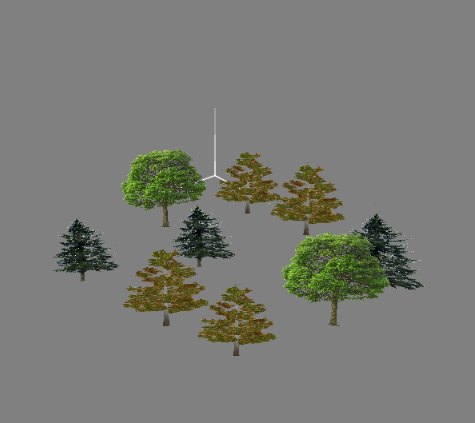

# Final CG Project T04G08

Class: T04
Group: G08

## Group Members

- Marco André (up202004891)
- Ricardo Matos (up202007692)

## Implemented Functionalities

We implemented all asked functionalities.
The additonal feature we chose to implement was the wind on the trees.

## Additional Information

We support some extra controls on the bird:

- `Left Shift` - Fly up
- `Left Ctrl` - Fly down
- `V` - Toggle First Person View

## Screenshots

Fig. 1 - Panorama

Fig. 2 - Simple Bird

Fig. 3 - Modeled Bird

Fig. 4 - Terrain

Fig. 5 - Eggs and Nest

Fig. 6 - Eggs and Simple Nest

Fig. 7 - Tree Patch

Fig. 8 - Additional Feature: Wind on trees

## Credits

We used tree textures from <https://www.pngwing.com/en/free-png-txqzn/download>

The models used in this project were obtained from the following sources:
 > Eagle: <https://sketchfab.com/3d-models/my-animated-eagle-40dd320d0e2342ae9ae9343d4f90c09b>
 > Nest: <https://sketchfab.com/3d-models/osprey-nest-concept-430a2d149c49414ca66df5acfacfa4ed>
 > Egg texture: made with <https://openai.com/product/dall-e-2>